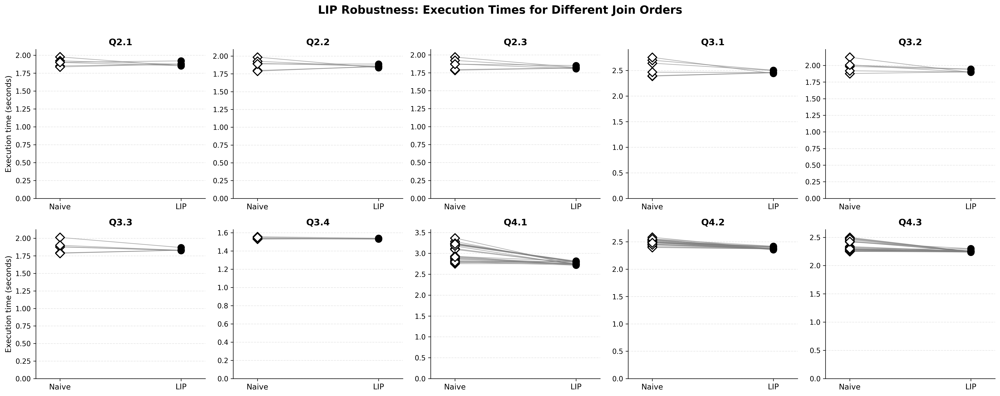
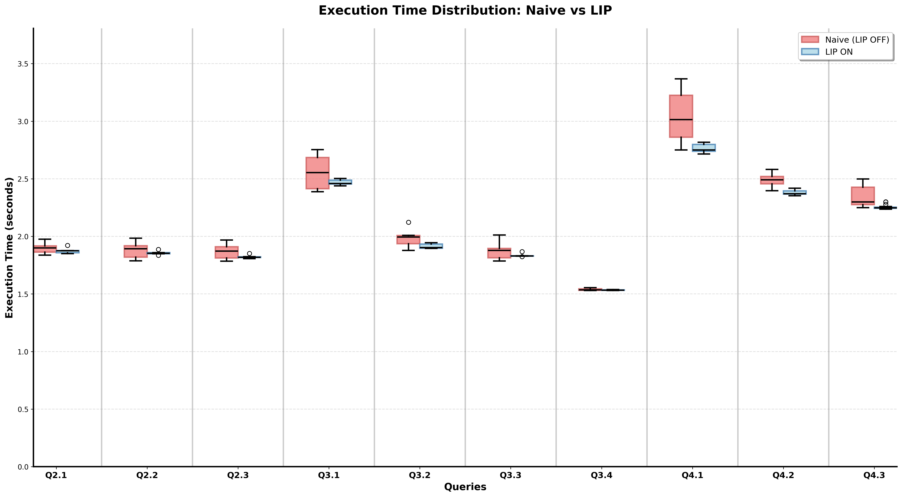
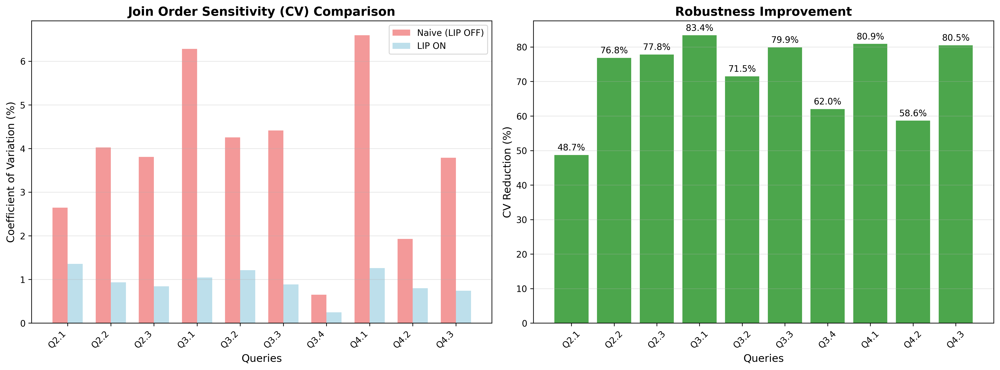
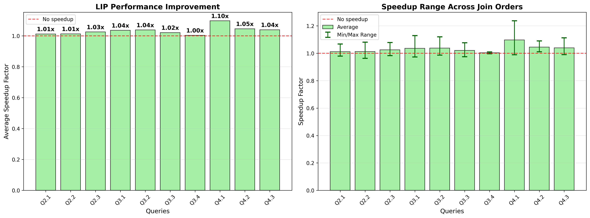

# Lookahead Information Passing in DuckDB

## Introduction

**Lookahead Information Passing (LIP)** is a query execution technique that makes query plans robust against poor join ordering decisions. This project implements and evaluates LIP in DuckDB, demonstrating how it can achieve near-optimal performance even when the query optimizer selects suboptimal join orders.

## Problem Statement

Modern analytic systems face significant challenges when executing queries on star schemas:

### Key Challenges:
- **Poor Join Ordering**: Query optimizers may select inefficient join orders, leading to drastically different performance for the same SQL query
- **NP-Hard Problem**: Finding the optimal join order in star schemas is computationally intractable
- **Cardinality Estimation Errors**: Errors in cardinality estimation grow exponentially over successive joins, making accurate optimization nearly impossible

### The Impact:
The same SQL query can be **sometimes very slow, sometimes very fast** depending on the join order selected by the optimizer. This unpredictability is unacceptable in production systems.

## Solution: Lookahead Information Passing (LIP)

LIP addresses these challenges by:

1. **Building filters alongside hash tables** during the build phase of hash joins
2. **Passing filters down to the probe side** and earlier stages of the query plan
3. **Applying filters early** to reduce the amount of data that needs to be processed

### Key Benefits:
- ✅ Makes queries **robust** to poor plan selection
- ✅ Achieves **near-optimal speed** even with suboptimal join orders
- ✅ Uses **minimal memory** (filters are small, typically fitting in cache)
- ✅ Includes **adaptive filter ordering** for maximum efficiency

## Experimental Results

### Setup
- **Dataset**: Star Schema Benchmark (SSB) at scale factor 100
- **Hardware**: AMD Ryzen 7 5800X (8 cores, 3.8 GHz), 128GB DDR4 RAM
- **Method**: Each join order variant run 10 times (median selected)

### Key Findings

#### 1. Robustness to Join Ordering

**With LIP, queries achieve nearly optimal speed even with poor join orders.** The execution time remains consistent across different join orderings.

#### 2. Execution Time Distribution

LIP significantly **reduces the variance** in execution times. Without LIP, queries have a much wider range of execution times, making performance unpredictable.

#### 3. Coefficient of Variation Comparison

The coefficient of variation (CV) demonstrates that **LIP makes query performance more stable** across different join orders.

#### 4. Performance Speedup

LIP doesn't just make queries more robust—**it makes them faster**. The speedup is most dramatic for poorly-ordered joins.

## Conclusion

Lookahead Information Passing successfully addresses the critical challenge of join ordering in star schema queries. By propagating filter information throughout the query plan, LIP ensures:

- **Consistent performance** regardless of join order
- **Significant speedups** for suboptimal plans
- **Minimal overhead** with small, cache-friendly filters

This makes DuckDB more resilient to optimizer errors and provides predictable, fast performance in production environments.

---

## 📄 Full Documentation

**[View the complete PDF presentation](duckdb-lookahead-information-passing.pdf)** for detailed implementation specifics, additional diagrams, and comprehensive analysis.

## References

- J. Zhu, et al.: *Looking Ahead Makes Query Plans Robust*. Proc. VLDB Endow. (2017)
- [CMU 15-721: Robust Query Planning](https://www.cs.cmu.edu/~15721-f25/slides/05-RobustQP.pdf)

